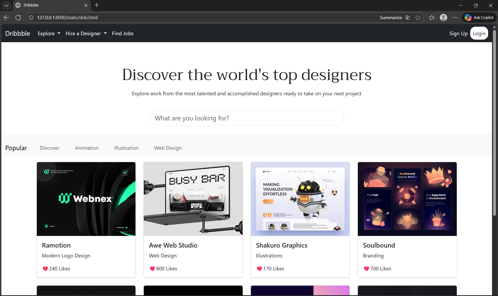
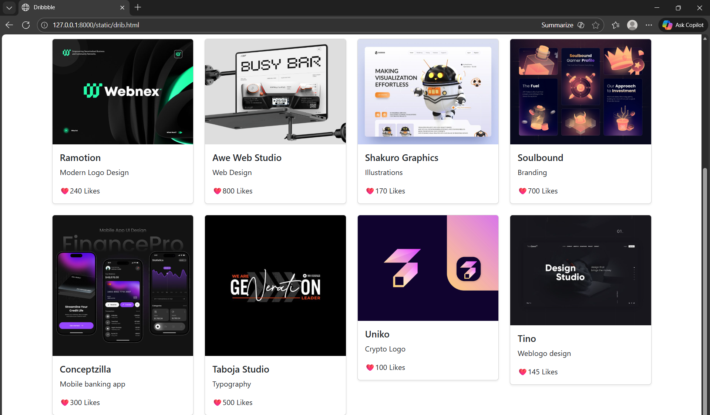

# Project Responsive Web Design using Bootstrap
## Date:

## AIM:
To create a simplified clone of Dribbble (https://dribbble.com/) landing page.


## DESIGN STEPS:

### Step 1:
Clone the repository from GitHub.

### Step 2:
Create Django Admin project.

### Step 3:
Create a New App under the Django Admin project.

### Step 4:
Insert the necessary CSS and JavaScript files as external in order to use Bootstrap.

### Step 5:
Create a HTML file and include the needed Bootstrap components.

### Step 6:
Publish the website in the LocalHost.

## PROGRAM :
```html
<!DOCTYPE html>
<html lang="en">

<head>
    <meta charset="UTF-8">
    <meta name="viewport" content="width=device-width, initial-scale=1.0">
    <title>Dribbble</title>
    <link href="https://cdn.jsdelivr.net/npm/bootstrap@5.3.0/dist/css/bootstrap.min.css" rel="stylesheet">
    <link
        href="https://fonts.googleapis.com/css2?family=Poppins:wght@300;400;600&family=Roboto:wght@300;400;500&family=Gloock&display=swap"
        rel="stylesheet">
    <link rel="stylesheet" href="https://fonts.googleapis.com/css?family=Audiowide|Sofia|Trirong">
    <link
        href="https://fonts.googleapis.com/css2?family=Alumni+Sans+Pinstripe:ital@0;1&family=Dancing+Script:wght@400..700&family=Montserrat:ital,wght@0,100;1,100&family=Roboto:ital,wght@0,100;0,300;0,400;0,500;0,700;0,900;1,100;1,300;1,400;1,500;1,700;1,900&display=swap"
        rel="stylesheet">

</head>

<body>

    <div class="bg-dark">
        <nav class="navbar navbar-expand-lg">
            <div class="container-fluid">
                <a class="navbar-brand text-white" href="#">Dribbble</a>
                <button class="navbar-toggler" type="button" data-bs-toggle="collapse" data-bs-target="#navbarNav">
                    <span class="navbar-toggler-icon"></span>
                </button>
                <div class="collapse navbar-collapse" id="navbarNav">
                    <ul class="navbar-nav me-auto">
                        <li class="nav-item dropdown">
                            <a class="nav-link dropdown-toggle text-light" href="#" id="exploreDropdown" role="button"
                                data-bs-toggle="dropdown">
                                Explore
                            </a>
                            <ul class="dropdown-menu">
                                <li><a class="dropdown-item" href="#">Product Design</a></li>
                                <li><a class="dropdown-item" href="#">Web Design</a></li>
                                <li><a class="dropdown-item" href="#">Animation</a></li>
                            </ul>
                        </li>
                        <li class="nav-item dropdown">
                            <a class="nav-link dropdown-toggle text-light" href="#" id="hireDropdown" role="button"
                                data-bs-toggle="dropdown">
                                Hire a Designer
                            </a>
                            <ul class="dropdown-menu">
                                <li><a class="dropdown-item" href="#">Browse designers</a></li>
                                <li><a class="dropdown-item" href="#">Post a job</a></li>
                                <li><a class="dropdown-item" href="#">Hiring on Dribbble</a></li>
                            </ul>
                        </li>
                        <a class="nav-link  text-light" href="#">
                            Find Jobs
                        </a>
                    </ul>
                    <ul class="navbar-nav ms-auto">
                        <li class="nav-item"><a class="nav-link text-light" href="#">Sign Up</a></li>
                        <li class="nav-item bg-white rounded-4"><a class="nav-link text-dark" href="#">Login</a></li>
                    </ul>
                </div>
            </div>
        </nav>
    </div>
    <br><br><br>
    <div class="container-fluid text-dark text-center display-5 fw-normal">
        <p style="font-family:Trirong;">Discover the world's top designers</p>
    </div>
    <div class="container-fluid text-dark text-center ">
        <p>Explore work from the most talented and accomplished designers ready to take on your next project</p>
    </div>
    <div class="container-fluid text-center p-4 rounded">
        <input type="text" placeholder="What are you looking for?"
            class="form-control form-control-lg mx-auto rounded-pill" style="max-width: 600px;" id="i1">
    </div>
    
  <nav class="navbar navbar-expand-lg navbar-light bg-light">
    <div class="container-fluid">
      <a class="navbar-brand mt-3" href="#">Popular</a>
      <div class="collapse navbar-collapse justify-content-left">
        <ul class="navbar-nav">
          <li class="nav-item mx-3 mt-3">
            <a class="nav-link" href="#">Discover</a>
          </li>
          <li class="nav-item mx-3 mt-3">
            <a class="nav-link" href="#">Animation</a>
          </li>
          <li class="nav-item mx-3 mt-3">
            <a class="nav-link" href="#">Illustration</a>
          </li>
          <li class="nav-item mx-3 mt-3">
            <a class="nav-link" href="#">Web Design</a>
          </li>
        </ul>
      </div>
    </div>
  </nav>

    <div class="container mt-3">
        <div class="row row-cols-1 row-cols-sm-2 row-cols-md-4 g-4">
            <!-- Example Project Card -->
            <div class="col">
                <div class="card project-card shadow-sm">
                    
                    <div class="card-body">
                        <h5 class="card-title">Ramotion</h5>
                        <p class="card-text">Modern Logo Design</p>
                        <p class="card-text">❤️240 Likes</p>
                    </div>
                </div>
            </div>
            <!-- Add more cards here -->
            <div class="col">
                <div class="card project-card shadow-sm ms-auto">
                    
                    <div class="card-body">
                        <h5 class="card-title">Awe Web Studio</h5>
                        <p class="card-text">Web Design</p>
                        <p class="card-text">❤️800 Likes</p>
                    </div>
                </div>
            </div>
            <div class="col">
                <div class="card project-card shadow-sm">
                    
                    <div class="card-body">
                        <h5 class="card-title">Shakuro Graphics</h5>
                        <p class="card-text">Illustrations</p>
                        <p class="card-text">❤️170 Likes</p>
                    </div>
                </div>
            </div>
            <div class="col">
                <div class="card project-card shadow-sm ">
                    
                    <div class="card-body">
                        <h5 class="card-title">Soulbound</h5>
                        <p class="card-text">Branding</p>
                        <p class="card-text">❤️700 Likes</p>
                    </div>
                </div>
            </div>
            <div class="col">
                <div class="card project-card shadow-sm ">
                    
                    <div class="card-body">
                        <h5 class="card-title">Conceptzilla</h5>
                        <p class="card-text">Mobile banking app</p>
                        <p class="card-text">❤️300 Likes</p>
                    </div>
                </div>
            </div>
            <div class="col">
                <div class="card project-card shadow-sm ">
                    
                    <div class="card-body">
                        <h5 class="card-title">Taboja Studio</h5>
                        <p class="card-text">Typography</p>
                        <p class="card-text">❤️500 Likes</p>
                    </div>
                </div>
            </div>
            <div class="col">
                <div class="card project-card shadow-sm ">
                    
                    <div class="card-body">
                        <h5 class="card-title">Uniko</h5>
                        <p class="card-text">Crypto Logo</p>
                        <p class="card-text">❤️100 Likes</p>
                    </div>
                </div>
            </div>
            
            <div class="col">
                <div class="card project-card shadow-sm ">
                    
                    <div class="card-body">
                        <h5 class="card-title">Tino</h5>
                        <p class="card-text">Weblogo design</p>
                        <p class="card-text">❤️145 Likes</p>
                    </div>
                </div>
            </div>
        </div>
    </div>
    <footer class="bg-dark text-white py-3">
        <div class="container text-center">
            <p class="mb-0">@2025 Dribble Designed and developed by VIGNESH P</p>
        </div>
    </footer>
    <script src="https://cdn.jsdelivr.net/npm/bootstrap@5.3.0/dist/js/bootstrap.bundle.min.js"></script>
</body>

</html>
```

## OUTPUT:



## RESULT:
The Project for responsive web design using Bootstrap is completed successfully.
